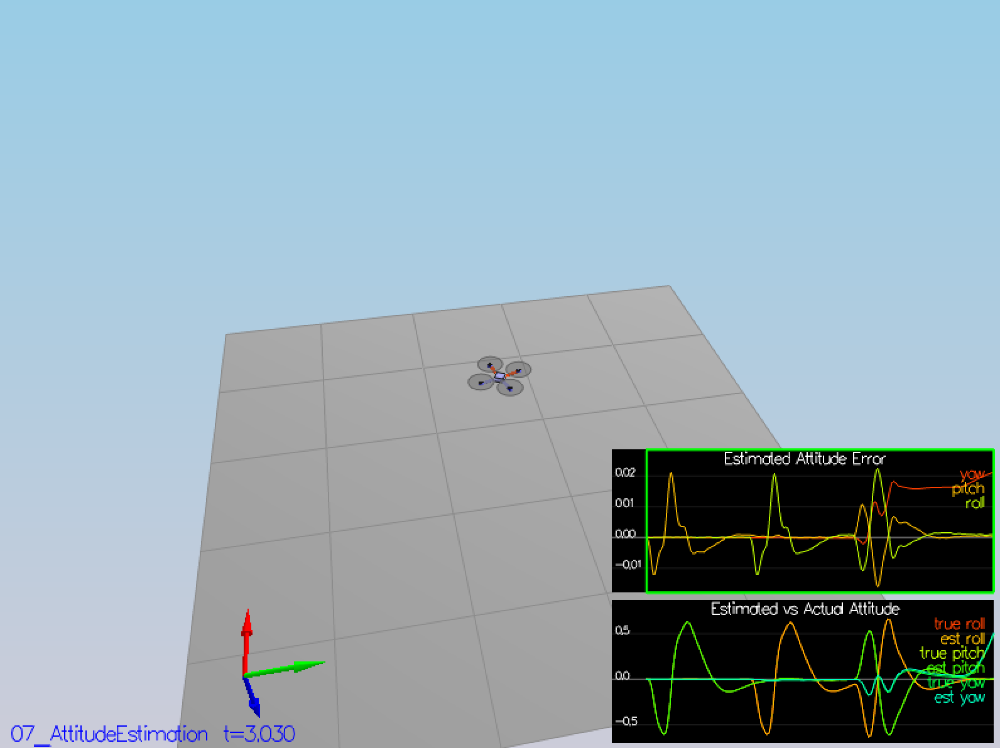
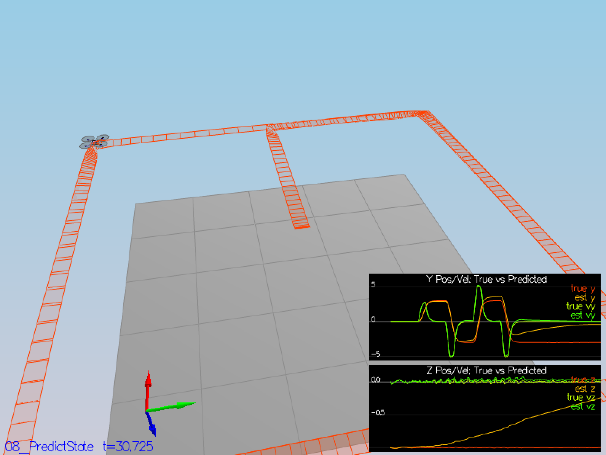
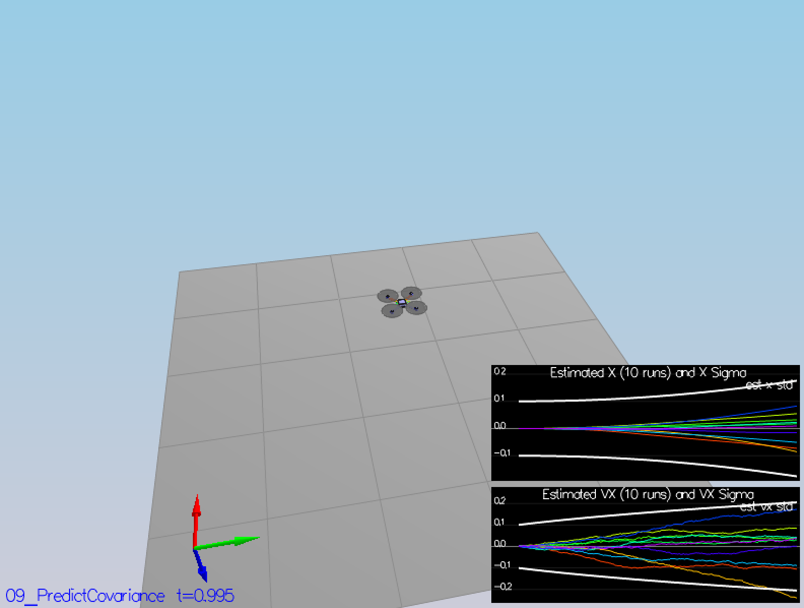

# Drone Estimator

## Getting Started

```
    # install Qt5
    $ export Qt5Core_DIR=/usr/local/opt/qt/lib/cmake/Qt5Core
    $ export Qt5Network_DIR=/usr/local/opt/qt/lib/cmake/Qt5Network
    $ export Qt5Widgets_DIR=/usr/local/opt/qt/lib/cmake/Qt5Widgets

    $ mkdir _build && cd _build
    $ cmake ..
    $ make
    $ ./CPPSim
```

Simulator Commands

- ``right click``: choose scenario;
- ``left drag``: rotate;
- ``X + left drag``: pan;
- ``arrow keys``: apply external force;
- ``C``: clear all graphs;
- ``R``: reset simulation;
- ``Space``: pause simulation.

## Codes

```
    drone-controller/
          +---- images/              scenario images
          +---- config/              configuration files for controller and vehicle
          +---- lib/                 external libraries
          +---- project/             IDE configurations
          +---- src/                 codes
          +---- tools/               tools
          +---- CMakeLists.txt
          +---- README.rst
```

## Solution: Scenario 06_SensorNoise

By calculating the standard deviation of ``Quad.GPS.X`` and ``Quad.IMU.AX`` data located at ``config/log/``,
the charts in the scenario ``06_SensorNoise`` would be shown that the dashed lines turn green within +/- 1
sigma bound on the y-axis capturing the value of approximately 68% of the respective measurements.

The formula of standard deviation is as following:


^2})  

With the Numpy API ``numpy.std(data)``, the implemention is located at ``tools/06_SensorNoise``:

```
import numpy as np

class SensorNoise(object):

    def __init__(self, datafile):
        self.data = np.loadtxt(datafile, delimiter=',', skiprows=1)

    def mean(self):
        return np.mean(self.data[:, 1])

    def std(self):
        return np.std(self.data[:, 1])


if __name__=='__main__':
    gpsfile = "../config/log/Graph1.txt"
    gps = SensorNoise(gpsfile)
    print "Quad.GPS.X std: ", gps.std()

    imufile = "../config/log/Graph2.txt"
    imu = SensorNoise(imufile)
    print "Quad.IMU.AX std: ", imu.std()
```

Run the result:

```
# the results will be updated instantly, corresponding to the data grows.
$ python 06_SensorNoise.py
Quad.GPS.X std:  0.71384784768
Quad.IMU.AX std:  0.511644801594

$ ./CPPSim
PASS: ABS(Quad.GPS.X-Quad.Pos.X) was less than MeasuredStdDev_GPSPosXY for 68% of the time
PASS: ABS(Quad.IMU.AX-0.000000) was less than MeasuredStdDev_AccelXY for 70% of the time
```

The figures turn green as shown below:


## Solution: Scenario 07_AttitudeEstimation

With the reference of the paper [Attitude Estimation Control of Autonomous Aerial Vehicles](https://tel.archives-ouvertes.fr/tel-01201539/document), 
the attitude kinematics using the minimal Euler angles parametrization is defined as following:

=\omega_x+\sin(\phi)\tan(\theta)\omega_y+\cos(\phi)\tan(\theta)\omega_z)

=\cos(\phi)\omega_y-\sin(\phi)\omega_z)

=\frac{\sin(\phi)}{\cos(\theta)}\omega_y+\frac{\cos(\phi)}{\cos(\theta)}\omega_z)

Notation reference:

- x axis: roll, phi
- y axis: pitch, theta
- z axis: yaw, psi

Codes implemented in ``UpdateFromIMU()``:

```
   ////////////////////////////// BEGIN STUDENT CODE ///////////////////////////
   // SMALL ANGLE GYRO INTEGRATION:
   // (replace the code below)
   // make sure you comment it out when you add your own code -- otherwise e.g. you might integrate yaw twice

   // ref: 1.4 Attitude kinematics and dynamics, Attitude Estimation Control of Autonomous Aerial Vehicles, P25
   // url: https://tel.archives-ouvertes.fr/tel-01201539/document
   V3F angleDot;
   angleDot.x = gyro.x + sin(rollEst) * tan(pitchEst) * gyro.y + cos(rollEst) * tan(pitchEst) * gyro.z;
   angleDot.y = cos(rollEst) * gyro.y - sin(rollEst) * gyro.z;
   angleDot.z = sin(rollEst) * gyro.y / cos(pitchEst) + cos(rollEst) * gyro.z / cos(pitchEst);

   float predictedPitch = pitchEst + dtIMU * angleDot.y;
   float predictedRoll = rollEst + dtIMU * angleDot.x;
   ekfState(6) = ekfState(6) + dtIMU * angleDot.z;       // yaw
   // float predictedPitch = pitchEst + dtIMU * gyro.y;
   // float predictedRoll = rollEst + dtIMU * gyro.x;
   // ekfState(6) = ekfState(6) + dtIMU * gyro.z;        // yaw

   // normalize yaw to -pi .. pi
   if (ekfState(6) > F_PI) ekfState(6) -= 2.f*F_PI;
   if (ekfState(6) < -F_PI) ekfState(6) += 2.f*F_PI;

   /////////////////////////////// END STUDENT CODE ////////////////////////////
```

Run the result:

```
$ make
$ ./CPPSim
Simulation #1 (../config/07_AttitudeEstimation.txt)
Simulation #2 (../config/07_AttitudeEstimation.txt)
PASS: ABS(Quad.Est.E.MaxEuler) was less than 0.100000 for at least 3.000000 seconds
Simulation #3 (../config/07_AttitudeEstimation.txt)
PASS: ABS(Quad.Est.E.MaxEuler) was less than 0.100000 for at least 3.000000 seconds
...
```

A green box is shown at the chart of estimated attitude error:



## Solution: Scenarios 08_PredictState & 09_PredictCovariance

In general, the prediction phase in the Extended Kalman Filter is defined as:

+W_t)

+Q_t)

Where

- X_t: the state at time t;
- F(X, U): the state transition function;
- W_t: the state noise at time t;
- P_t: the covariance at time t;
- G(X): the Jocobian function;
- Q_t: the covariance noise at time t.

At the stage of this project, there are three steps separately:

- ``Predict()``: the main prediction function, returning ``ekfState`` and ``ekfCov``;
- ``PredictState()``: the calculation of ``ekfState``;
- ``GetRbgPrime()``: the calculation of the partial derivative of the Rbg matrix for ``ekfCov``.

Regarding to the ``ekfState`` in the ``PredictState()``, the formulas applied are as below:


Where

- P[x, y, z]: the position on x/y/z axis;
- V[x, y, z]: the velocity on x/y/z axis;
- A[x, y, z]: the acceleration on x/y/z axis;
- g: the gravity.


Concerning on the ``ekfCov`` in the ``Predict()`` and ``GetRbgPrime``, the formulas implemented correspondingly as:

Step 1. Calculating the partial derivative of the rotation matrix from body frame to global frame by the roll, pitch and yaw values.

``:

```
   ////////////////////////////// BEGIN STUDENT CODE ///////////////////////////
   V3F curAccel = attitude.Rotate_BtoI(accel);

   predictedState(0) = curState(0) + curState(3) * dt;
   predictedState(1) = curState(1) + curState(4) * dt;
   predictedState(2) = curState(2) + curState(5) * dt;
   predictedState(3) = curState(3) + curAccel.x * dt;
   predictedState(4) = curState(4) + curAccel.y * dt;
   predictedState(5) = curState(5) + curAccel.z * dt - CONST_GRAVITY * dt;
   /////////////////////////////// END STUDENT CODE ////////////////////////////
```


Running the result, the true (y, vy, z, vz) and the estimated (y, vy, z, vz) would 
be apporximately overlapped. 



Codes implemented in ``GetRbgPrime()``:

```
   ////////////////////////////// BEGIN STUDENT CODE ///////////////////////////
   float sinPhi = sin(roll);
   float cosPhi = cos(roll);
   float sinTheta = sin(pitch);
   float cosTheta = cos(pitch);
   float sinPsi = sin(yaw);
   float cosPsi = cos(yaw);

   RbgPrime(0, 0) = - cosTheta * sinPsi;
   RbgPrime(0, 1) = - sinPhi * sinTheta * sinPsi - cosPhi * cosPsi;
   RbgPrime(0, 2) = - cosPhi * sinTheta * sinPsi + sinPhi * cosPsi;
   RbgPrime(1, 0) = cosTheta * cosPsi;
   RbgPrime(1, 1) = sinPhi * sinTheta * cosPsi - cosPhi * cosPsi;
   RbgPrime(1, 2) = cosPhi * sinTheta * cosPsi + sinPhi * sinPsi;
   /////////////////////////////// END STUDENT CODE ////////////////////////////
```

Codes implemented in ``Predict()``:

```
   ////////////////////////////// BEGIN STUDENT CODE ///////////////////////////
   gPrime(0, 3) = dt;
   gPrime(1, 4) = dt;
   gPrime(2, 5) = dt;
   gPrime(3, 6) = (RbgPrime(0) * accel).sum() * dt;
   gPrime(4, 6) = (RbgPrime(1) * accel).sum() * dt;
   gPrime(5, 6) = (RbgPrime(2) * accel).sum() * dt;

   ekfCov = gPrime * ekfCov * gPrime.transpose() + Q;
   /////////////////////////////// END STUDENT CODE ////////////////////////////
```

Fine tunning the parameters in ``config/QuadEstimatorEKF.txt``:

```
QPosXYStd = .02
QVelXYStd = .18
```




