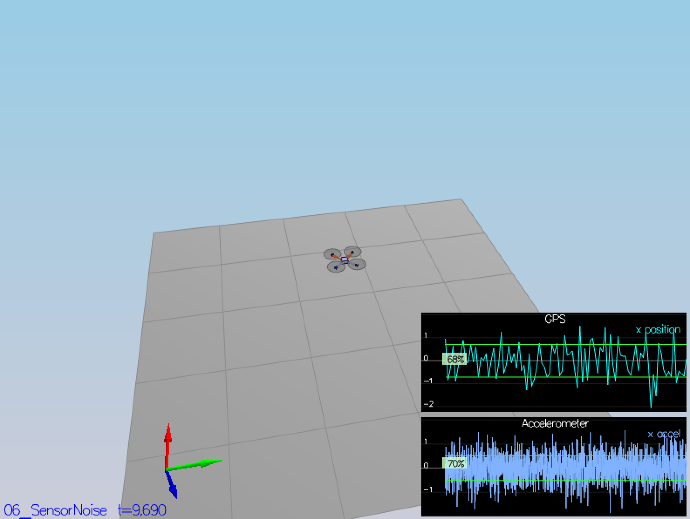

# Drone Estimator

## Getting Started

```
    # install Qt5
    $ export Qt5Core_DIR=/usr/local/opt/qt/lib/cmake/Qt5Core
    $ export Qt5Network_DIR=/usr/local/opt/qt/lib/cmake/Qt5Network
    $ export Qt5Widgets_DIR=/usr/local/opt/qt/lib/cmake/Qt5Widgets

    $ mkdir _build && cd _build
    $ cmake ..
    $ make
    $ ./CPPSim
```

Simulator Commands

- ``right click``: choose scenario;
- ``left drag``: rotate;
- ``X + left drag``: pan;
- ``arrow keys``: apply external force;
- ``C``: clear all graphs;
- ``R``: reset simulation;
- ``Space``: pause simulation.

## Codes

```
    drone-controller/
          +---- images/              scenario images
          +---- config/              configuration files for controller and vehicle
          +---- lib/                 external libraries
          +---- project/             IDE configurations
          +---- src/                 codes
          +---- tools/               tools
          +---- CMakeLists.txt
          +---- README.rst
```

## Solution: Scenario 06_SensorNoise

By calculating the standard deviation of ``Quad.GPS.X`` and ``Quad.IMU.AX`` data located at ``config/log/``,
the charts in the scenario ``06_SensorNoise`` would be shown that the dashed lines turn green within +/- 1
sigma bound on the y-axis capturing the value of approximately 68% of the respective measurements.

The formula of standard deviation is as following:


^2})  

With the Numpy API ``numpy.std(data)``, the implemention is located at ``tools/06_SensorNoise``:

```
import numpy as np

class SensorNoise(object):

    def __init__(self, datafile):
        self.data = np.loadtxt(datafile, delimiter=',', skiprows=1)

    def mean(self):
        return np.mean(self.data[:, 1])

    def std(self):
        return np.std(self.data[:, 1])


if __name__=='__main__':
    gpsfile = "../config/log/Graph1.txt"
    gps = SensorNoise(gpsfile)
    print "Quad.GPS.X std: ", gps.std()

    imufile = "../config/log/Graph2.txt"
    imu = SensorNoise(imufile)
    print "Quad.IMU.AX std: ", imu.std()
```

Run the result:

```
# the results will be updated instantly, corresponding to the data grows.
$ python 06_SensorNoise.py
Quad.GPS.X std:  0.71384784768
Quad.IMU.AX std:  0.511644801594

$ ./CPPSim
PASS: ABS(Quad.GPS.X-Quad.Pos.X) was less than MeasuredStdDev_GPSPosXY for 68% of the time
PASS: ABS(Quad.IMU.AX-0.000000) was less than MeasuredStdDev_AccelXY for 70% of the time
```

The figures turn green as shown below:




## Solution: Scenario 07_AttitudeEstimation

With the reference of the paper [Attitude Estimation Control of Autonomous Aerial Vehicles], the
attitude kinematics using the minimal Euler angles parametrization is defined as following:

=\omega_x+\sin(\phi)\tan(\theta)*\omega_y+\cos(\phi)\tan(\theta)*\omega_z)

=\cos(\phi)*\omega_y-\sin(\phi)*\omega_z)

=\frac{\sin(\phi)}{\cos(\theta)}*\omega_y+\frac{\cos(\phi)}{\cos(\theta)}*\omega_z)

Notation reference:

- x axis: roll, phi
- y axis: pitch, theta
- z axis: yaw, psi

Codes implemented in ``UpdateFromIMU()``:

```
   ////////////////////////////// BEGIN STUDENT CODE ///////////////////////////
   // SMALL ANGLE GYRO INTEGRATION:
   // (replace the code below)
   // make sure you comment it out when you add your own code -- otherwise e.g. you might integrate yaw twice

   // ref: 1.4 Attitude kinematics and dynamics, Attitude Estimation Control of Autonomous Aerial Vehicles, P25
   // url: https://tel.archives-ouvertes.fr/tel-01201539/document
   V3F angleDot;
   angleDot.x = gyro.x + sin(rollEst) * tan(pitchEst) * gyro.y + cos(rollEst) * tan(pitchEst) * gyro.z;
   angleDot.y = cos(rollEst) * gyro.y - sin(rollEst) * gyro.z;
   angleDot.z = sin(rollEst) * gyro.y / cos(pitchEst) + cos(rollEst) * gyro.z / cos(pitchEst);

   float predictedPitch = pitchEst + dtIMU * angleDot.y;
   float predictedRoll = rollEst + dtIMU * angleDot.x;
   ekfState(6) = ekfState(6) + dtIMU * angleDot.z;       // yaw
   // float predictedPitch = pitchEst + dtIMU * gyro.y;
   // float predictedRoll = rollEst + dtIMU * gyro.x;
   // ekfState(6) = ekfState(6) + dtIMU * gyro.z;        // yaw

   // normalize yaw to -pi .. pi
   if (ekfState(6) > F_PI) ekfState(6) -= 2.f*F_PI;
   if (ekfState(6) < -F_PI) ekfState(6) += 2.f*F_PI;

   /////////////////////////////// END STUDENT CODE ////////////////////////////
```

Run the result:

```
$ make
$ ./CPPSim
Simulation #1 (../config/07_AttitudeEstimation.txt)
Simulation #2 (../config/07_AttitudeEstimation.txt)
PASS: ABS(Quad.Est.E.MaxEuler) was less than 0.100000 for at least 3.000000 seconds
Simulation #3 (../config/07_AttitudeEstimation.txt)
PASS: ABS(Quad.Est.E.MaxEuler) was less than 0.100000 for at least 3.000000 seconds
...
```

A green box is shown at the chart of estimated attitude error:


